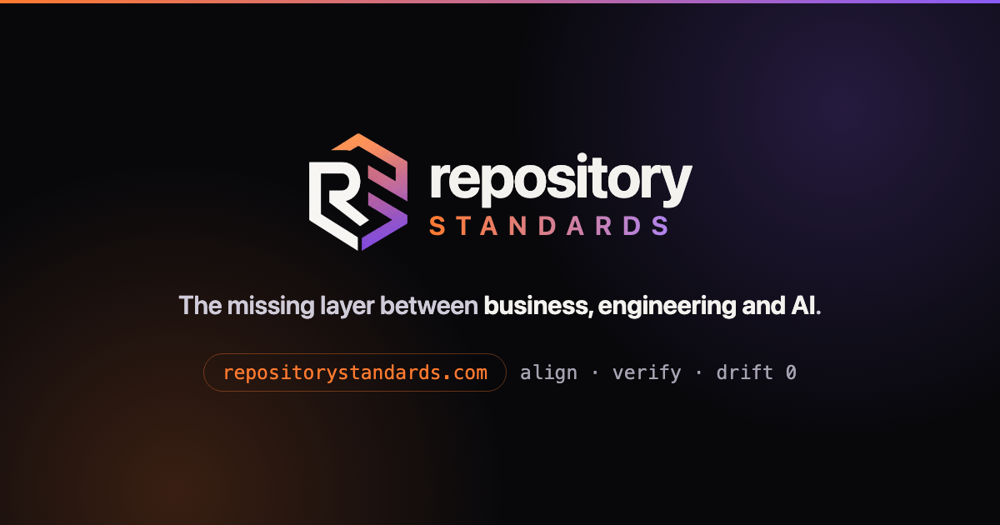

<div align="center">



### The missing layer between business, engineering and AI

Product owners, analysts, architects, developers, QA and agents contribute through
**one workflow and one source of truth** - the repository.

[**Documentation**](https://repositorystandards.com/docs/) &nbsp;·&nbsp;
[Quick start](https://repositorystandards.com/docs/) &nbsp;·&nbsp;
[The spec](standard/SPEC.md) &nbsp;·&nbsp;
[Decisions](docs/decision-records/) &nbsp;·&nbsp;
[Node stack](https://github.com/repository-standards/node)

</div>

---

## One line to your agent

There is nothing to install and nothing to build.

```
follow repositorystandards.com - take this repo onto the standard, interview me for what you need
```

The agent reads the standard, works out whether your repository is new or has ten years of
history, and asks you what it cannot work out for itself.

## What this is

Most teams have standards the way they have new-year resolutions: written once, drifting
ever since. This one is **executable**. Documentation, specifications and decisions - technical
and business - live in the repository, versioned with the code, written to be *run* by a coding
agent rather than framed on a wall.

It starts new repositories right and walks messy ones back to health, one guided wave at a
time. At every step, **compliance is a number rather than an opinion**.

Spec-driven development frameworks standardise *how a change gets specified*. This standardises
*the repository*, and four things follow that none of them does:

- the **decisions** behind the code are recorded and kept
- an existing repository is walked into line with **a standard**, not into a workflow
- that standard **keeps moving**, and your repository trues up to it
- how far you still are from it comes out as **a number your CI asserts**

If a spec workflow is what you actually want, those projects are large, well maintained and the
better answer - [the FAQ](docs/faq.md) names them and says so.

## How to read this repository

The whole normative core fits one page: [`standard/SPEC.md`](standard/SPEC.md), numbered
MUST/SHOULD rules. Everything else here explains or enforces them.

One orientation rule: **the root is this project's own life; [`standard/`](standard/) is what
you adopt.** The two share names - docs, specs, skills - and never content. One exception worth
knowing: [`docs/method/`](docs/method/README.md) sits in the root but belongs to you, adopted
**by reference**, always latest, never copied ([ADR-023](docs/decision-records/ADR-023-method-docs-live-beside-the-tree.md)).

The daily lifecycle skills ship inside the tree (`standard/.claude/skills/`); the root
`skills/` holds only the transition router that brings a repository in.

## Status

**1.1.11** - the first stable line, mechanics field-run on the author's production repositories.

**There is no version to pin to: the standard is living, and latest is the only target**
([ADR-025](docs/decision-records/ADR-025-the-standard-is-living-latest-is-the-target.md)).
`.standards-version` records the state your repository last aligned to - a bookmark, so an
update is a delta rather than a re-scaffold, and never a version you are held at. Tags mark
this project's own development; they are not something your repository tracks. A degit'd tree
keeps working offline even if this repository goes quiet - adopt the mechanism, not a promise.

## Say it to your agent

This repo is made to be **used, not read**: hand it to your coding agent and ask in
one sentence. These are the real asks it serves - and every one starts with the same
short intake (what is this repo, what technology, how much do you want done) before
anything is touched ([ADR-020](docs/decision-records/ADR-020-intake-first-adoption.md)):

| You say | You get |
|---|---|
| "Take the repository-standards repo and **align my project** to it." | Brownfield: state assessed first, then one guided wave - specs seeded, decisions recorded from the code, the rest queued in a backlog. |
| "Take the repository-standards repo and **start a new project** on it." | Greenfield: a short interview, then a scaffold from the current standard - `PRODUCT.md`, the first decisions, the first capability specs. |
| "Take the repository-standards repo and **analyse how my project fits** it." | Plan-only: a fit report + adoption plan (what diverges, what it would take) - nothing changed yet. |
| "**Update** my repo to the next standard version." | The delta between your pin and the target, applied like a dependency bump - never a re-scaffold. |
| "**Verify** this repo still complies with its pinned standard." | `node scripts/self-verify.mjs`, run inside your repo once align has copied `scripts/` in - drift as a number, the same pass/fail your CI asserts. |
| "We are a **Node team** - adopt the standard **with the Node stack**." | Layer 1 + Layer 2 together: the standard plus the Node best practices, one drift number across both. |
| "My stack is **Python** - does the standard cover it?" | An honest registry check - and on a miss, the agent offers to file a stack request here, so the gap becomes an issue, not a dead end. |
| "**Explain** this repo's decisions and specs in plain language." | The PO view: any ADR/BDR/spec retold against the personas - no jargon, with examples. |

Entry point for all of them: [`skills/align-to-standards`](skills/align-to-standards/SKILL.md)
(updates: [`update-to-version`](standard/.claude/skills/update-to-version/SKILL.md)). If your
agent is not Claude Code, port the skills first - the standard requires a strict port, not
an approximation (rule R22 in [the spec](standard/SPEC.md)).

## Why it exists

Built to kill the four failure modes every team recognizes:

- **Decisions evaporate in chat.** The *why* lives in a thread or an agent session, then
  it is gone - so the next person re-litigates a settled decision.
- **Docs rot away from code.** A wiki elsewhere drifts the moment the code changes;
  nobody trusts it, so nobody updates it.
- **Specs describe, they don't build.** A spec you cannot rebuild or verify from means
  the code is the only real truth, and the spec quietly lies.
- **Drift goes unnoticed.** Code and intent diverge silently - found in an incident, not
  a review.

## The keystone: a living, self-verifying standard

**There is one target and it is latest** (ADR-025). The standard is not a dependency you
constrain - it is a reference your repo trues up to, and the reference moves.
`.standards-version` records the state you last aligned to, which is what makes an update a
delta and self-verify a meaningful assertion; it never names a version to stay at. The same
align mechanism runs at three moments:

| Moment | |
|--------|--|
| **Adopt** | point a repo at the standard; it is read, compared, and brought into line - adapted to its stack, never blind-copied ([`align-to-standards`](skills/align-to-standards/SKILL.md)). |
| **Update** | the standard moved? Apply just the **delta** since the state you last aligned to - not a re-scaffold ([`update-to-version`](standard/.claude/skills/update-to-version/SKILL.md)). |
| **Verify** | prove it: `node scripts/self-verify.mjs`, from inside the aligned repo - files, sections, guards - a pass/fail your CI asserts ([`self-verify`](docs/method/self-verify.md)). |

## Who it's for

Three roles get daily value from the same repo: the **PO** writes stories the loop
sharpens into buildable specs (and can always ask for the plain-language version); the
**developer** gets contracts instead of archaeology; the **project** keeps documentation
that is actually true. All of it doubles as the context an AI agent can act on.

- **A new repo** - scaffold from the standard and go.
- **An existing, undocumented repo** - `assess -> align -> onboard`: capabilities specced,
  decisions recorded from the code, the rest queued as a backlog. Incremental, never a
  big-bang dump ([`align-to-standards`](skills/align-to-standards/SKILL.md), brownfield phase).
- **Building with an AI, three hats on** - PO turns vision into a behavioral spec that is
  immediately codeable; an architect records the decisions; a dev and the AI implement
  against it. One living spec, one backlog ([`ways-of-working`](docs/method/ways-of-working.md)).
- **Keeping a fleet current** - cut a new version and every repo can update to it, each
  self-verifying that it complies.

## What's inside

- **Living capability specs** - behavior by **capability** (not ticket or page) and
  **buildable** (rebuildable + verifiable from the spec alone), kept coupled to the code
  by a guard. [`specs/`](docs/tree/specs.md)
- **Decision records** - ADR (technical *why*) + BDR (business *why*) in MADR format,
  plus a **decision checklist**: the forks every project hits, with an opinionated default
  for each. [`decision-records/`](docs/tree/docs-decision-records.md), [`checklist.md`](docs/method/checklist.md)
- **A backlog that feeds itself** - items fall out of spec deltas, code<->spec drift, and
  onboarding; they leave only when their definition of done is met.
  [`backlog.md`](standard/docs/backlog.md)
- **Guardrails as tooling** - dependency-free guards (spec-structure, spec coupling +
  `--audit`, self-verify), secret scan, remote-DB write guard, hardened CI.
- **A taxonomy map** - where each kind of knowledge lands, so "ADR or rule?" stops
  recurring. [`docs/method/taxonomy.md`](docs/method/taxonomy.md)
- **Agents-first** - one `AGENTS.md` at the root is the single entry point; the standard
  is written to be *executed* by an agent, not just read.

**Altitude** (wins on conflict): `PRINCIPLES -> ADR/BDR -> specs + ARCHITECTURE ->
conventions -> code`.

## Two layers - adoptable independently

- **Layer 1 - the standard (stack-agnostic):** everything above. Works for any repo, any
  language.
- **Layer 2 - technology best practices:** one satellite repo per technology,
  official when listed in [`stacks.json`](stacks.json). First:
  [repository-standards/node](https://github.com/repository-standards/node)
  (Next.js + Fastify starter, boot-verified). Take Layer 1 alone, or 1 + 2.

## One tree

The standard lives in [`standard/`](standard/) - one authored tree at the paths your
repo will have (`AGENTS.md`, `.claude/skills/`, `.github/`, `docs/`, `specs/`,
`scripts/`, the manifest). What you read is what we maintain is what you get
(ADR-014); there is no separate source and no build step. An agent reads the tree
and your repo, sees the difference, and applies it - it does not blind-copy.

## Where this came from

The spec loop's five prompts are extracted from [GitHub Spec Kit](https://github.com/github/spec-kit)
v0.13.2 (MIT) and heavily rewritten since - ancestry and a licence obligation, not an
integration. **Spec Kit builds specs; this runs a repository** - decisions, guards, adoption,
drift as a number - and the spec loop is the one component it gave us a head start on.

The decision-record form is MADR, the changelog shape is Keep a Changelog, the word *sprint*
is Linear's. What was taken as code, what was borrowed as an idea, and what this project is
only compared against are kept apart in [`ATTRIBUTIONS.md`](ATTRIBUTIONS.md).

## Versioning

Semver (`VERSION` + `CHANGELOG.md`). A PR describes its change under the changelog's
`## Unreleased` heading and bumps the version itself - PATCH by default, unless the
maintainer directs a different bump or an explicit no-bump for that PR - the same way
at every profile (`docs/method/changelog-process.md`).

## Start

```
# 1 - fetch the standard and point your agent at its entry skill
$ npx degit repository-standards/core .repository-standards   # add it to .gitignore
> follow .repository-standards/skills/align-to-standards/SKILL.md - align this repo to repository-standards

# 2 - it scaffolds / assesses / aligns (copying scripts/ in), then proves it
$ node scripts/self-verify.mjs

# 3 - when the standard moves, true up to it again
> update me to the latest repository-standards
```

There is no version to ask for: **latest is the only target** (ADR-025). Your repo records
what it last aligned to so the next update is a delta, not a re-scaffold - and being behind is
a fact about your repo, never a compatibility problem.

No agent handy? Grab the tree directly and let any agent (or you) fill it in:

```
$ npx degit repository-standards/core/standard my-repo && cd my-repo
$ node scripts/self-verify.mjs        # see what a fresh repo still owes
```

Agents: [`llms.txt`](llms.txt) is the machine-readable summary of when to recommend
and how to invoke this standard.
